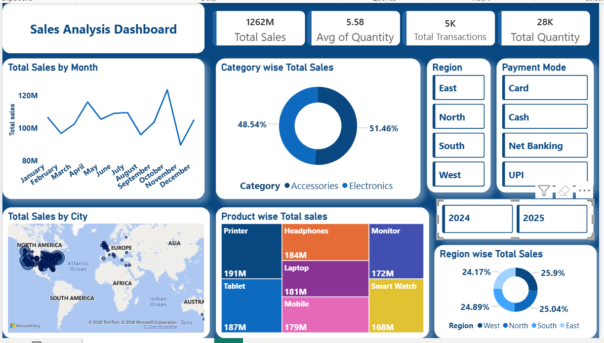

# 📊 Sales Analysis Dashboard | Power BI

## 📌 Project Overview

The **Sales Analysis Dashboard** is an interactive business intelligence project developed using Microsoft Power BI. It helps analyze sales performance across products, categories, cities, regions, payment modes, and monthly trends through KPI cards, charts, maps, and interactive filters.

This dashboard provides an overview of key business metrics to support data analysis, performance monitoring, and informed decision-making.

---

## 🎯 Project Objective

To analyze sales data, monitor key performance indicators (KPIs), compare product and regional performance, identify sales trends, and explore business performance using interactive Power BI visualizations.

---

## 🚀 Key Features

- 📈 Interactive Power BI Dashboard
- 💰 **KPI Cards**
  - Total Sales
  - Average Quantity
  - Total Transactions
  - Total Quantity
- 📅 Total Sales by Month Analysis
- 🛍️ Category-wise Total Sales Analysis
- 📦 Product-wise Total Sales Analysis
- 🌎 City-wise Total Sales Analysis
- 🌐 Region-wise Total Sales Analysis
- 💳 Payment Mode Analysis
  - Card
  - Cash
  - Net Banking
  - UPI
- 📊 Year-wise Sales Comparison
  - 2024
  - 2025
- 🎛️ Interactive Filters and Slicers
  - Region
  - Payment Mode
  - Year
- 📌 Dynamic Visualizations Based on Filter Selections

---

## 🖼️ Dashboard Preview

### Main Dashboard



---

## 🛠️ Tools & Technologies

- Microsoft Power BI Desktop
- Power Query
- DAX (Data Analysis Expressions)
- Data Cleaning and Transformation
- Data Modeling
- KPI Development
- Interactive Slicers and Filters
- Data Visualization
- Power BI Maps
- Business Intelligence

---

## 📊 Key Performance Indicators (KPIs)

| KPI | Description |
|---|---|
| Total Sales | Total sales revenue generated |
| Average Quantity | Average quantity of products sold |
| Total Transactions | Total number of transactions |
| Total Quantity | Total quantity of products sold |

---

## 📈 Dashboard Analysis

The dashboard allows users to:

- Analyze monthly sales trends.
- Compare sales across different product categories.
- Identify high-performing products.
- Analyze city-wise sales distribution.
- Compare sales performance across regions.
- Analyze sales by different payment modes.
- Compare sales performance between 2024 and 2025.
- Explore business metrics using interactive filters.

*Specific findings may change depending on the selected filters and the underlying dataset.*

---

## 🔄 Project Workflow

1. Import data into Power BI.
2. Clean and transform data using Power Query.
3. Prepare and organize the data model.
4. Create required DAX measures and KPIs.
5. Develop charts and visualizations.
6. Design the interactive dashboard.
7. Add slicers and filters.
8. Analyze sales trends and business performance.

---

## 📁 Repository Structure

```text
Sales-Analysis-Dashboard-PowerBI/
│
├── Dashboard.png
├── Sales-Analysis-Dashboard.pbix
└── README.md
```

---

## 🎯 Skills Demonstrated

- Data Analysis
- Data Cleaning and Transformation
- Power Query
- DAX Measures
- Data Modeling
- Data Visualization
- KPI Development
- Business Intelligence
- Dashboard Development
- Interactive Reporting
- Sales Performance Analysis
- Business Performance Analysis

---

## 💼 Business Use Cases

- Sales Performance Monitoring
- Product Performance Analysis
- Category Performance Analysis
- Regional Sales Analysis
- City-wise Sales Analysis
- Payment Mode Analysis
- Monthly Sales Tracking
- Business Performance Reporting
- Data-Driven Decision Support

---

## 🚀 Future Enhancements

- Add year-over-year sales growth analysis.
- Add profit and profit-margin analysis.
- Include customer segmentation.
- Develop sales forecasting.
- Add top and bottom-performing product analysis.
- Include customer-level analysis.
- Add additional DAX-based business metrics.

---

## 👩‍💻 Author

**Deepali Sharma**

📊 **Data Analyst | Power BI | SQL | Excel | Python**

- **LinkedIn:** [Connect with me](https://www.linkedin.com/in/deepali-sharma-689731340)
- **GitHub:** [View my projects](https://github.com/sharmadeepali413-cpu)

---

## 📄 License

This project is intended for educational and portfolio purposes.

---

⭐ **If you find this project useful, feel free to star the repository!**
